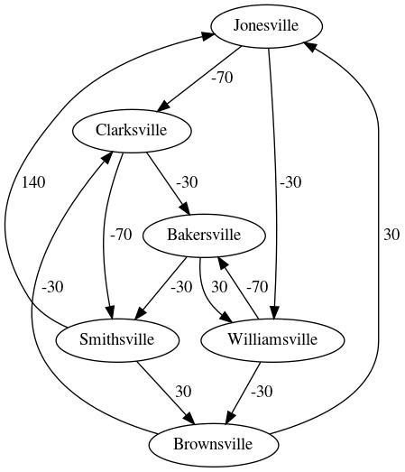

# MDP-PsuedoRewards
The scripts are written to reproduce the interesting work done by Lieder, F. and Chen, O. X. and Krueger, P. M. and Griffiths, T.L. as explained in the article ['Cognitive Prostheses for Goal Achievement'](https://www.nature.com/articles/s41562-019-0672-9).

## finite_horizon_mdp.py
Computing optimal incentives for decision-support. As per the paper **'Cognitive Prostheses for Goal Achievement'** , the function computes the optimal reward function (Equation 10) for the version of the flight planning problem shown in Figure 1A where the total number of flights is known (i.e., a finite horizon MDP with gamma=1). The function takes the remaining number of flights and the current location as input arguments and return the incentives for the choices that are available in that location.
<!--  -->

## to_do_list.py

The MDP model that Lieder, Chen, Krueger, and Griffiths (2019) used to compute optimal incentives for to-do list gamification. The fucntion assumes that there are five to-dos that take 5,10,15,20,25 minutes to complete respectively, the user values their time at about $8 per hour and that the discount factor is less than 1.

To check the results of the MDP model, please run the attached program `to_do_list.py` and enter the current state separated by space. The output shows the next possible state with the respective optimal incentive.

For eg.: `input: 0 0 0 1 0`  denotes that only the fourth task ,out of five available tasks, is completed and rest are still incomplete.

Task No.|Writing Assignment| Rewards |Duration|
--------|-------------------| -------|---------|
1| How has North Korea’s economic policy changed since the 1950s? What are the reasons and implications of these changes?|-$3.00 |5
2| Please analyze the causes and implications of the British exit referendum in June 2016.|-$3.25 |10
3|Describe with examples the importance of recognizing and responding to concerns about children and young people’s development.|-$2.25 |15
4|Write an essay about how society should assign value to human life.|$-3.00 |20
5|What is your favorite TV show and why? |-$1.00 |25

*Note*: The to_do_list.py is not optimised for large no. of tasks due to its exponential time complexity.

